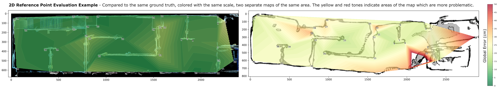
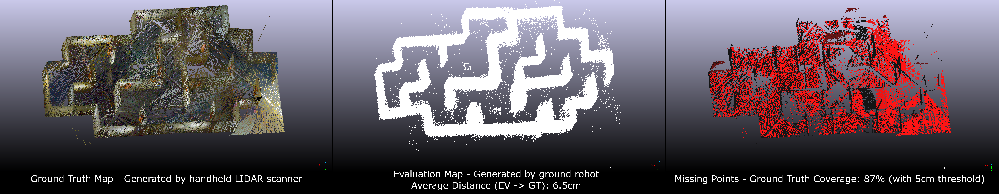
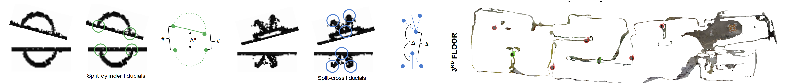

# Mapping Accuracy Evaluation     
## **UNDER ACTIVE DEVELOPMENT**  
This package provides a toolkit for evaluating the accuracy between a map created by a robotic system, and a ground truth map. Currently there are three methods implemented in this package which serve different purposes.  
  
## Methods  
### Labelled Reference Point Evaluation (2D/3D)  
   
This is primarily done by identifying corresponding points in both the ground truth and evaluation map, giving each correspondance a unique label, and storing this information in separate CSV files with the fields [label, x, y] or [label, x, y, z] for 3D evaluations. Those CSV files can then be loaded in by the toolkit and metrics can be calculated. This method is generally the most labor intensive to set up, especially in 3D, as corresponding points need to be labelled in the ground truth and evaluation map. The higher the number of reference points being used, the more detailed the information this method can provide, but the more time it will take to label. This can be mitigated by employing some kind of automated labeling using unique QR Codes or AprilTags, but so far this has been difficult to do with ground truth map generation.  
Rather than looking at absolute distance between point A in the ground truth vs point A in the evaluation map, this method compares the relative differenece in each *pair* of points between the ground truth and the evaluation map. Consequently, this method has the advantage of being able to ignore global coordinate frame alignment and scaling. In addition to providing information on scale, this method can also provide individual error scores for each point, which can be plotted to highlight problematic areas of the map (not currently implemented for 3D). This allows easy inspection into which areas are problematic, and which areas are accurate.      
  
### Direct Cloud to Cloud Evaluation (3D)  
   
Cloud to cloud evaluation is suitable for 3D evaluations, and generally requires less setup work than reference point evaluations, but it also comes with limitations. This method requires a best-fit global alignment of the evaluation map to the ground truth, as the metrics calculated rely on absolute distance measurements. Because of this, a map which has two accurate areas connected by some kind of distorted area will be scored harshly, and there is no programmatic way to determine when this is the case. This method calculates the average distances between clouds, as well as a coverage metric which determines the percentage of ground truth points for which the evaluation map also has a point within a specified threshold proximity.  
With this method, an evaluation map could get high coverage by simply filling a volume with points, however the average Eval to GT distance would be very high. Conversely, an evaluation map could get very low average distance by having sparse points with high certainty, but the coverage would suffer. Therefore, these two metrics should be considered jointly.  

### Split Fiducial Evaluation (2D)  
  
This method requires preparing the physical mapping environment with easily identifiable artifacts, which align with each other on opposite sides of walls, sometimes separated by floors. Building and setting up these fiducials can be time intensive, but afterwards, map evaluations can be done easily, without necessarily requiring any software to do so. Each fiducial is scored as pass/fail, which can either be done by eye, or using a software tool to measure the distance and angle between fiducial points, and determining whether they pass based on specified thresholds. The concept of this method is simple, if two halves of a fiducial are either unidentifiable or they don't line up; there is an issue with that part of the map. With that said, the resolution, and detail of information this method can provide is very minimal.  
  
**RUNNABLE SCRIPTS**  
* **cloud_to_cloud_evaluation.pyy** - (3D) Directly compares two 3D pointclouds which need to already be aligned with each other. Prints out some basic information for each cloud for comparison, calculates the distance from ground truth to eval as well as evel to ground truth, and calculates Completeness/Coverage of the ground truth map within a specified tolerance. Optionally saves a new point cloud containing all outlier points to visualized the areas of the ground truth which are not covered. Reads in the run configuration from cloud_eval_config.json so the script does not need to be changed. Setting either input file to 'null' will prompt you with a file dialogue to select each input cloud.    
* **reference_point_evaluation.py** -  (2D/3D) This script takes in two sets of labelled points (and optionally a map background image), calculates and logs all relevant metrics between the two points, and generates plots to visualize the metrics when doing 2D evaluations. It functions exactly the same for 3D evaluations, but doesn't generate any plots, only metrics. These metrics are global error and scale factors; they score the maps accuracy holistically.  
* **map_labeller.py** - (2D) Script is used to label 2D evaluation points within a map image. Points can easily be imported, edited, and exported in a format that can be used by the evaluation tool. *NOTE: For 3D evaluations, a tool like CloudCompare can be used to export labelled 3D point lists.*   
* **fiducial_evaluation.py** - (2D) This tool is used for performing fiducial evaluations (currently either cylinder or splitcross type). Fiducials are artifacts placed within the mapping area to assess local errors within the map.    
* **align_pts_to_map.py** - (2D) Tool for aligning reference points to a corresponding map image and saving the new transformed points (for visualizing)  
* **cloud_slicer.py** - Script which allows the user to easily generate specific cross-sections of 3D clouds as labelled png images. Useful for judging 3D maps as 2D maps, or making 3D maps easier to present/visualize for end users.   
  
**METRICS**  
* Coverage - The percentage of labelled ground truth points contained in the list of evaluation points.    
* Error Average (and Std Dev) - The average of all point errors. Point error is the average absolute difference (between ground truth and evaluation points) in distance between a given point and every other point being evaluated.    
* Scale Factor Average (and Std Dev) - Similar to the Error Average calculation, but instead of comparing absolute differences in distance, the relative difference in distance are expressed as a scaling ratio (GT Distance / Eval Distance).  
* Scaled Error Average (and Std Dev) - The evaluation points are scaled by the factor determined by the Scale Factor Average metric, and the Error metric is recomputed.  
* Fiducial Score - An alternate evaluation method which utilizes artificual fiducials placed in the mapping environment. Fiducials are evaluated on a pass/fail basis, based on specified criteria for distance and angle tolerance with respect to the ground truth. Expressed as a percentage of passing fiducials.  
     
**HELPER FILES**  
* calculate_metrics.py - Contains all functions for calculating metrics AND generating plots  
  
* csv_loader.py - Provides functions for loading and reformatting csv files, which can then be used as reference points for 2D and 3D evaluations    
  
* point_manip.py - Contains all functions for manipulating points objects. Translate, rotate, scale, align, etc.  
   
* utilities.py - Provides various functions for writing files, drawing on images, etc.  
  
